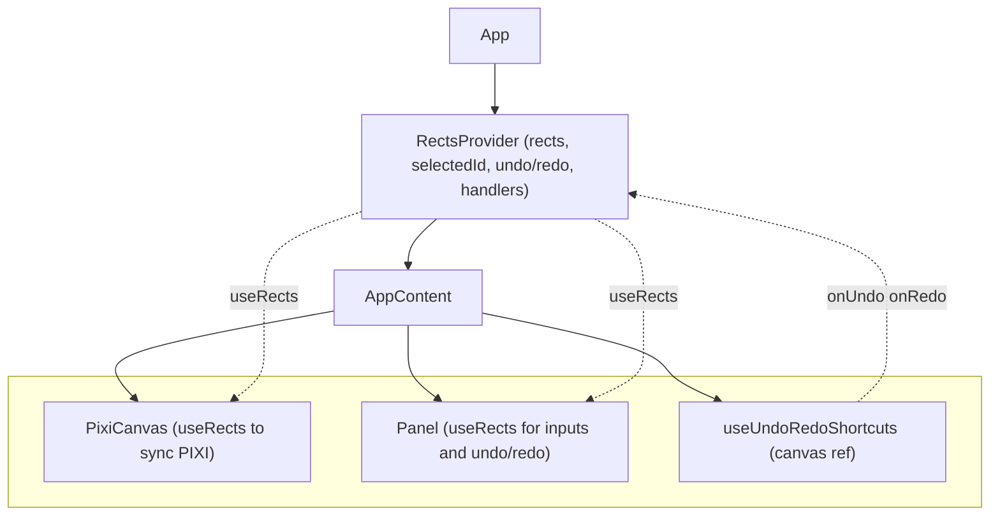
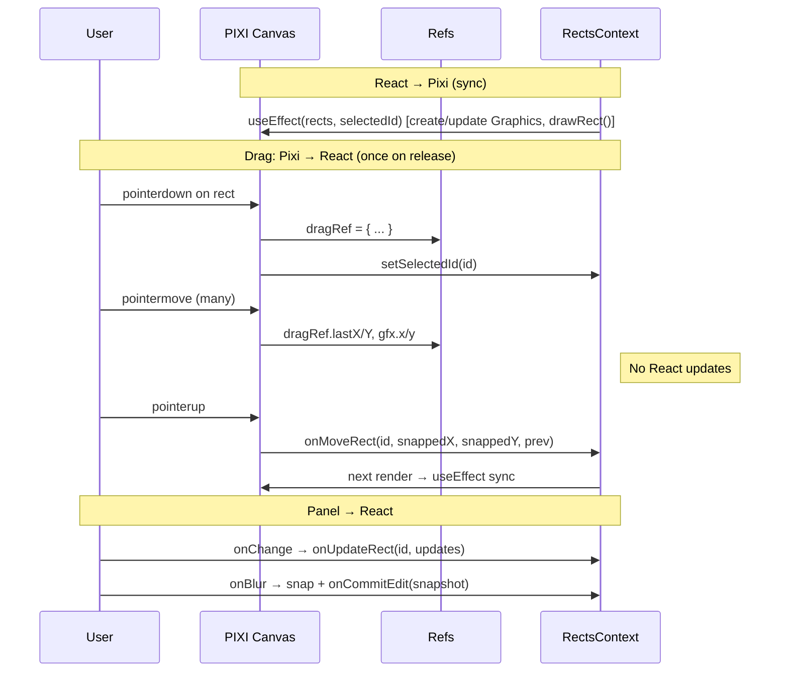

For a step-by-step overview of how this challenge was tackled (tasks, order of work, and bonus items), see [tasks.md](./tasks.md).

## Scripts

| Command | Description |
|---------|-------------|
| `yarn dev` | Start the development server |
| `yarn build` | Typecheck and build for production |
| `yarn preview` | Preview the production build |
| `yarn test` | Run tests in watch mode |
| `yarn test:run` | Run tests once (e.g. for CI) |
| `yarn test:coverage` | Run tests and generate coverage report (text + HTML in `coverage/`) |

## Testing

The project includes **unit testing** using [Vitest](https://vitest.dev/) and [React Testing Library](https://testing-library.com/react). Tests are run in a [jsdom](https://github.com/jsdom/jsdom) environment, and coverage is generated with **@vitest/coverage-v8**. Additional testing utilities include **@testing-library/jest-dom** (custom matchers) and **@testing-library/user-event** (user interactions). Test files live next to source as `*.test.tsx` or `*.spec.tsx`; use `yarn test` for watch mode or `yarn test:coverage` for a coverage report.

## Architecture

The app is structured around a single **RectsContext** that holds all rect and undo/redo state. The root `App` wraps the tree in `RectsProvider`; `AppContent` renders the canvas and panel and wires keyboard shortcuts. **PixiCanvas** and **Panel** read from context via `useRects()` and no longer receive rect/undo props (no prop drilling).

- **`src/context/RectsContext.tsx`** — Provider with `rects`, `selectedId`, undo/redo stacks, and all handlers (`onMoveRect`, `onUpdateRect`, `onCommitEdit`, `onUndo`, `onRedo`). Exposes `useRects()` for consumers.
- **`src/App.tsx`** — Renders `RectsProvider` and `AppContent`. `AppContent` uses `useRects()` for shortcuts and a ref for the canvas container, then renders `PixiCanvas` (ref only) and `Panel` (no props).
- **`src/components/PixiCanvas.tsx`** — PIXI canvas: syncs `rects` from context to PIXI.Graphics, handles drag (with refs only during drag), snap-to-grid on release. Uses `useRects()` for data and callbacks.
- **`src/components/Panel.tsx`** — Right panel: Undo/Redo buttons and controlled inputs (x, y, width, height, fill) for the selected rect. Uses `useRects()` for `selectedRect`, undo/redo, and update handlers.
- **`src/hooks/useUndoRedoShortcuts.ts`** — Listens for Cmd/Ctrl+Z and Cmd/Ctrl+Shift+Z (and Y) when the canvas container is focused; calls undo/redo and prevents default to avoid browser actions when there’s nothing to undo/redo.
- **`src/hooks/useRenderLog.ts`** — Dev-only hook to log re-renders and which tracked values changed; used to verify memoization and avoid unnecessary re-renders.

## State

- **RectsContext (single source of truth):** `rects`, `selectedId`, `undoStack`, `redoStack`. All updates go through context handlers; no duplicate state elsewhere.
- **Drag state:** Kept out of React state. `PixiCanvas` uses a ref (`dragRef`) for the active drag (id, start pointer, initial rect position, last position, `hasMoved`). During drag, only PIXI Graphics (`gfx.x`, `gfx.y`) are updated; React state is updated once on pointerup via `onMoveRect` with the snapped position.
- **Panel edit session:** A ref (`editStartRef`) stores the rect snapshot when the user focuses an input; on blur (or when switching selection), we push that snapshot to the undo stack once via `onCommitEdit`, so panel edits are one undo step per edit session rather than per keystroke.

## React <-> Pixi communication

- **React → Pixi:** A `useEffect` in `PixiCanvas` depends on `rects` and `selectedId`. It creates/removes/updates PIXI.Graphics to match `rects`, and calls `drawRect(gfx, rect, selected, position)` to set geometry, fill, selection stroke, and position. When only `selectedId` changes, we only redraw the two rects whose selection state changed to avoid a full pass over all rects.
- **Pixi → React:** User actions are handled inside the canvas with refs and PIXI events. On rect pointerdown we set `dragRef` and call `setSelectedId(rect.id)` (and focus the container). On pointermove we update `dragRef.lastX/lastY` and `gfx.x/y` only (no React updates). On pointerup we call `onMoveRect(id, snapToGrid(lastX), snapToGrid(lastY), { x: rectX, y: rectY })`, which updates context once. So React only sees the final, snapped position; no re-renders during drag.
- **Panel → React:** Inputs call `onUpdateRect(id, updates)` on change (fluent typing). On blur we optionally snap that field to the 20px grid and call `onUpdateRect` again if needed, and `onCommitEdit` runs to push the edit-session snapshot for undo.

## Undo/Redo Strategy

- **Model:** A history entry is a full rect snapshot (`RectSnapshot`: `id`, `x`, `y`, `width`, `height`, `fill`). The undo stack holds “previous states to restore”; redo holds “states we undid so we can re-apply.”
- **Push:** When the user moves a rect (drag end), we push the rect’s state *before* the move. When they edit in the panel, we push the rect’s state *before* the edit session on first focus; we commit that single snapshot on blur via `onCommitEdit` (so one undo per edit session, not per keystroke).
- **Undo:** Pop from undo stack, apply that snapshot to the matching rect, push the current rect state onto the redo stack.
- **Redo:** Pop from redo stack, apply to the rect, push current state onto the undo stack.
- **Shortcuts:** Handled by `useUndoRedoShortcuts` when the canvas container has focus. We prevent default for the relevant key combos so the browser doesn’t run its own undo/history even when there’s nothing to undo/redo.

## Performance

- **Context:** Handlers in `RectsContext` are wrapped in `useCallback`; `selectedRect` and the context value are memoized with `useMemo` so consumers don’t re-render unnecessarily when unrelated context fields change.
- **Components:** `PixiCanvas` and `Panel` are wrapped in `React.memo` so they only re-render when their props (or context slice they use) actually change.
- **Drag:** No React state during drag; only refs and direct PIXI Graphics updates. A single `onMoveRect` call on pointerup commits the snapped position.
- **Pixi sync effect:** When only `selectedId` changes, we redraw only the previously selected and newly selected rects instead of all rects.
- **Panel edits:** One undo push per edit session (on blur), not per keystroke; snap-to-grid is applied on blur so typing stays fluent.
- **Debug:** `useRenderLog` (dev-only) logs each render and which tracked deps changed so we can confirm we’re avoiding unnecessary re-renders.

## If you had more time, what you'd improve or finish

*(Leave as-is or fill in later.)*
